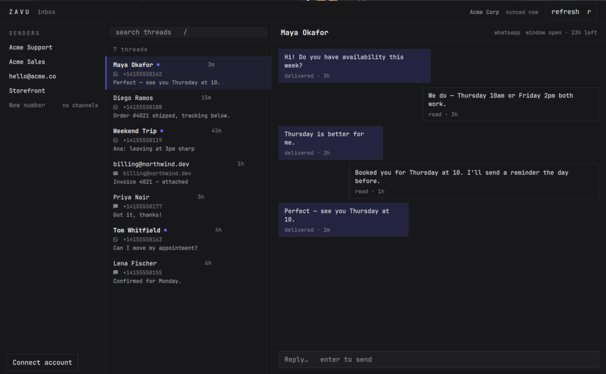
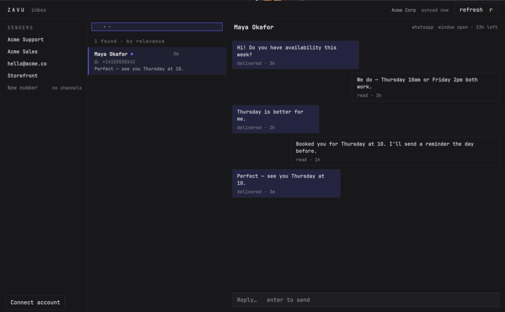

# Zavu Inbox for Omarchy

Every conversation your business numbers are having — WhatsApp, SMS, email,
Telegram — one keystroke away, inside the shell you already live in.

No browser. No tab. No context switch.



## What is Zavu

[Zavu](https://zavu.dev) is one API for every messaging channel: WhatsApp, SMS,
Telegram, Email, Instagram, Messenger and voice. One `send()` call, and Zavu
picks the channel, transforms the content for it, and falls back when one fails.

Businesses use it to run support, sales and notifications across channels
without wiring up five different providers. This plugin puts the conversation
side of that — the human part — into your desktop.

**One API. Every message.** → [zavu.dev](https://zavu.dev)

## What it lets you do

- **Read and reply to every channel in one place.** WhatsApp, SMS, email and
  Telegram threads land in the same list. Replies leave from the number the
  contact already knows.
- **Know when something arrives** without a browser open. A quiet dot in the
  bar, a desktop notification when you want one, and a count when there is more
  than one.
- **Find a conversation by who it is with** — phone number in any format, email,
  group name or WhatsApp username. Paste `+1 (555) 123-4567` and it finds the
  thread stored as `+15551234567`.
- **Work from the keyboard.** `Super+M` to open, `j`/`k` through threads, `/` to
  search, `Enter` to reply, `Esc` to get out.
- **See what the channel actually allows.** WhatsApp's 24-hour window is shown
  as it counts down, and the composer closes when it lapses instead of letting
  you write something that would be refused.



## Install

```bash
omarchy plugin add https://github.com/zavudev/zavu-omarchy.git --enable
```

## Sign in

There is no separate login. If you have ever run `zavudev login` on this
machine, the plugin is already signed in — it reads the CLI's own credentials
and never writes to them.

```bash
npx zavudev@latest login
```

Your browser opens, you pick a project, and the bar picks it up the moment you
are done. No key to copy or paste.

Don't have an account yet? [Create one at zavu.dev](https://zavu.dev) — the free
plan is enough to try this.

## Hotkey

Add to `~/.config/hypr/bindings.lua`:

```lua
o.bind("SUPER, M", "Zavu inbox", function()
  hl.dispatch(hl.dsp.exec("omarchy-shell shell toggle dev.zavu.inbox '{}'"))
end)
```

## Keys

| Key | Action |
|-----|--------|
| `Super+M` | Open or close the inbox |
| `j` / `k` · arrows | Move through threads |
| `Enter` | Focus the composer, then send |
| `/` | Search threads |
| `r` | Refresh now |
| `Esc` | Clear the search, then close |

## Settings

Click the gear in the bar panel, or use Omarchy's settings screen. Everything
applies immediately — no restart:

| Setting | Default | |
|---|---|---|
| Desktop notifications | on | Off silences notifications; the unread dot stays |
| Refresh every | 30s | Faster while a panel is open |
| Threads per refresh | 25 | |
| Messages per thread | 25 | |

## Good to know

- **It checks for messages on a timer**, it does not hold a live connection —
  the status line always tells you how long ago it synced, so you never have to
  guess whether what you are looking at is current. Press `r` for a refresh now.
- **Search matches who the thread is with**, not the words inside it.
- **A sender with no channels can't send.** Those show greyed and labelled
  rather than looking ready — a phone number on its own does not enable SMS.

## Security

This plugin runs inside the Omarchy shell with your user's permissions, so it
keeps its reach as small as it can:

- It **never writes your API key** — it only reads the one `zavudev login`
  already created, and only shows its last four characters.
- It talks to **one host**, your Zavu API endpoint, over TLS. No telemetry, no
  analytics, no third party.
- Message content **never reaches a shell command**.

## License

MIT
